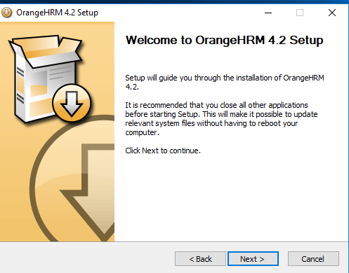
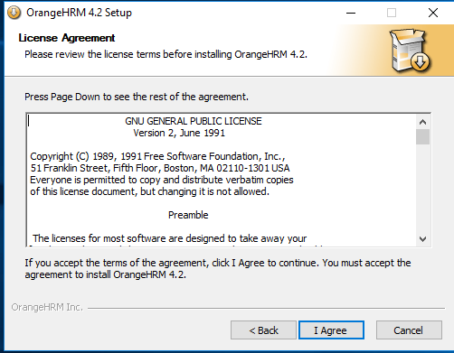
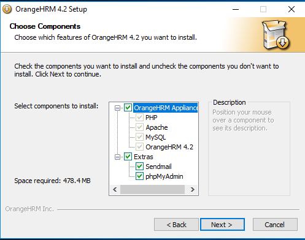
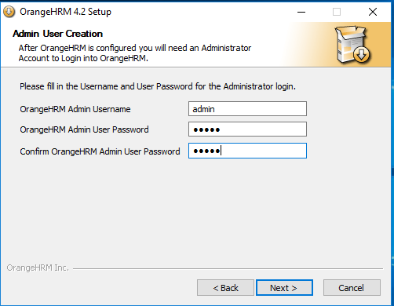
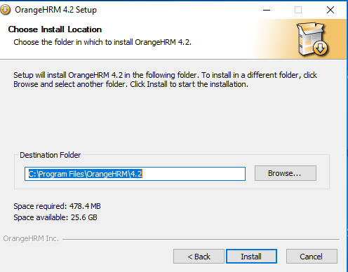
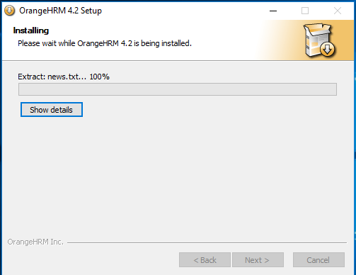
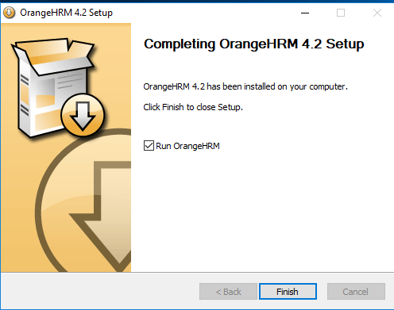
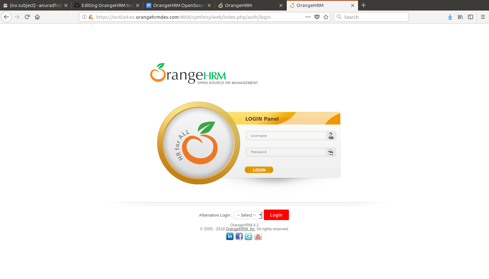

Installing OrangeHRM is quite easy. Whether you are using Windows or Linux, these steps will guide you through the installation process and you will have one of the best HRIS systems up and running within minutes.

Not a fan of reading? Why not watch the video tutorial that covers the entire installation process. 

The other per-requirements are:
MySQL 5.5 or later / MariaDB 5.5 or later,
Apache HTTP Server 2.4.6, 2.2.22 or later
Microsoft Visual C++ 2008 SP1 Redistributor Package (x86)
PHP 7.0 or later - If you already have Apache HTTP Web server (and PHP loaded as an Apache Module) and MySQL running, then you have everything you need
**Recommended Browsers**:     Mozilla Firefox 62.0 or later.
                Microsoft® Internet Explorer 5.5 or later
 ## Installation

Note:
XAMPP users, the Linux stack needs to be started manually. Refer to the stack documentation.

Using a JavaScript enabled browser go to http://hostname/orangehrm2/
Above hostname is "localhost" if it is installed in the machine you are currently working on or IP address if it is remotely hosted (i.e. external to the machine you are using)y

Installation will be briefly described below

### Welcome Screen

Welcome screen will state which version of OrangeHRM will be installed. Click Next to continue

### License Agreement

In this wizard, you will be provided with a copy of the GNU GENERAL PUBLIC LICENSE 
 
In order to continue with the installation process, it is mandatory to accept the terms and conditions stated in the Licence Agreement. Click [I Agree] button if you accept the terms and conditions of the license. Then you will be taken to the next page of the Web Installer.
 
If you wish to decline, you macy click [Cancel] button and that will discontinue the installation process while deleting all OrangeHRM files you posses.

### Components Check

Select the components you wish to install with OrangeHRM. You can uncheck additional components which may not be required to you. It is recommended to keep the checkboxes checked.

### Create Administrator credentials

You will need to create an administrator account to login to OrangeHRM system. Enter the Username  and Password to create an admin user for the system. You need to re enter the password again to confirm the password. These credentials will be used to login to the system as an admin user.

### Installation location

Select the destination which you prefer OrangeHRM to be installed. Default destination will be C:\Program Files\OrangeHRM\. Click install to proceed with installation.

 ### Installing

Here you will be shown the progress of the installation. Once the installation is completed the [Next] button will be enabled. Click [Next] when installation is complete to continue.

Note : If an error occurs during the installation, the whole installation will be aborted.

### Complete Installation

This ends the successful installation of OrangeHRM in your system. Click “Finish” to close the setup. 

You can use your user credentials that you created during installation process to access the system. 
 

pictures : https://drive.google.com/drive/folders/1rsoUiPgIrz_q3xE9HRtE45z_je9O5iw7?ogsrc=32

